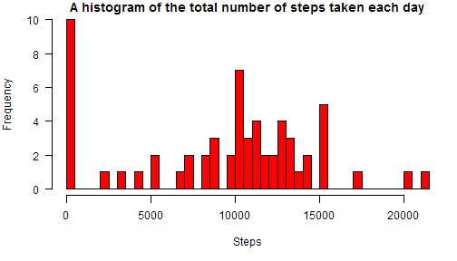
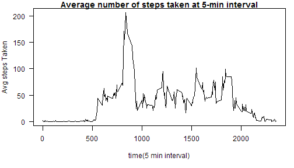
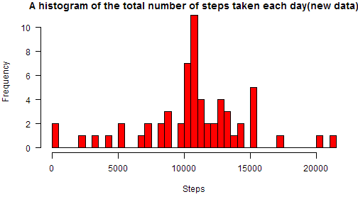
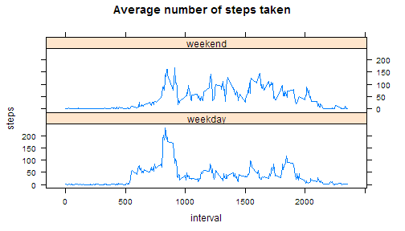

###Loading and preprocessing the data  
####1. Load the data and Transform

```r
library(stats)
activity.data <- read.csv(file = "activity.csv",header = T,sep = ",")
#rearranging column order
activity.data <- data.frame(date = activity.data$date,
                            interval = activity.data$interval,
                            steps = activity.data$steps)
```


###Mean total number of steps taken per day

```r
daywise.steps <- aggregate.data.frame(activity.data$steps,
                                      by = list(activity.data$date),
                                      FUN = sum,na.rm = T)
colnames(daywise.steps) <- c("date","steps")
```
####1. Make histogram  


```r
par(mar = c(5,4,1,1),las = 1)
hist(daywise.steps$steps,breaks = 50,xlab = "Steps",ylab = "Frequency",
     col = "red",main ="A histogram of the total number of steps taken each day" )
```

 

  
####2. Calculate Mean and Median  

```r
steps.mean <- round(mean(daywise.steps$steps),0)
steps.median <- median(daywise.steps$steps)
```

1.Mean total steps taken per day : **9354**  
2.Median total steps taken per day: **10395**     
  
### Average daily activity pattern


```r
intervalwise.steps <- aggregate.data.frame(activity.data$steps,
                                           by = list(activity.data$interval),
                                           FUN = mean,na.rm = T)
colnames(intervalwise.steps) <- c("interval","steps")
```

####1. Make times series plot 

```r
par(mar = c(5,4,1,1),las = 1)
plot(x = intervalwise.steps$interval,y = intervalwise.steps$steps,
     xlab = "time(5 min interval)",ylab = "Avg steps Taken",
     type = "l",main ="Average number of steps taken at 5-min interval" )
```

 

####2. Interval with maximum number of steps:
The 5 min interval starting 835, ending
840 contains the maximum number of steps.


### Inputing missing values
####1. Calculating number of missing values

```r
missing.val <- sum(is.na(activity.data$steps))
```

  
Total number of missing values in the dataset is 2304


  
####2. Filling in all of the missing values in the dataset using mean for that 5-minute interval.


```r
activity.newdata = activity.data
missing.df <- activity.newdata[is.na(activity.newdata$steps),]
missing.index <- match(missing.df$interval,intervalwise.steps$interval)
activity.newdata$steps[is.na(activity.newdata$steps)] <- intervalwise.steps$steps[missing.index]
```
 
 
 
  
Old data:

```r
library(xtable)  
xt.old <- xtable(head(activity.data))
print(xt.old,type = "html")
```

<!-- html table generated in R 3.0.2 by xtable 1.7-3 package -->
<!-- Sun Sep 14 06:37:37 2014 -->
<TABLE border=1>
<TR> <TH>  </TH> <TH> date </TH> <TH> interval </TH> <TH> steps </TH>  </TR>
  <TR> <TD align="right"> 1 </TD> <TD> 2012-10-01 </TD> <TD align="right">   0 </TD> <TD align="right">  </TD> </TR>
  <TR> <TD align="right"> 2 </TD> <TD> 2012-10-01 </TD> <TD align="right">   5 </TD> <TD align="right">  </TD> </TR>
  <TR> <TD align="right"> 3 </TD> <TD> 2012-10-01 </TD> <TD align="right">  10 </TD> <TD align="right">  </TD> </TR>
  <TR> <TD align="right"> 4 </TD> <TD> 2012-10-01 </TD> <TD align="right">  15 </TD> <TD align="right">  </TD> </TR>
  <TR> <TD align="right"> 5 </TD> <TD> 2012-10-01 </TD> <TD align="right">  20 </TD> <TD align="right">  </TD> </TR>
  <TR> <TD align="right"> 6 </TD> <TD> 2012-10-01 </TD> <TD align="right">  25 </TD> <TD align="right">  </TD> </TR>
   </TABLE>
  


  
####3. New dataset with the missing data filled in.
  
New data:

```r
library(xtable)  
xt.new <- xtable(head(activity.newdata))
print(xt.new,type = "html")
```

<!-- html table generated in R 3.0.2 by xtable 1.7-3 package -->
<!-- Sun Sep 14 06:37:37 2014 -->
<TABLE border=1>
<TR> <TH>  </TH> <TH> date </TH> <TH> interval </TH> <TH> steps </TH>  </TR>
  <TR> <TD align="right"> 1 </TD> <TD> 2012-10-01 </TD> <TD align="right">   0 </TD> <TD align="right"> 1.72 </TD> </TR>
  <TR> <TD align="right"> 2 </TD> <TD> 2012-10-01 </TD> <TD align="right">   5 </TD> <TD align="right"> 0.34 </TD> </TR>
  <TR> <TD align="right"> 3 </TD> <TD> 2012-10-01 </TD> <TD align="right">  10 </TD> <TD align="right"> 0.13 </TD> </TR>
  <TR> <TD align="right"> 4 </TD> <TD> 2012-10-01 </TD> <TD align="right">  15 </TD> <TD align="right"> 0.15 </TD> </TR>
  <TR> <TD align="right"> 5 </TD> <TD> 2012-10-01 </TD> <TD align="right">  20 </TD> <TD align="right"> 0.08 </TD> </TR>
  <TR> <TD align="right"> 6 </TD> <TD> 2012-10-01 </TD> <TD align="right">  25 </TD> <TD align="right"> 2.09 </TD> </TR>
   </TABLE>


  
####3. Mean total number of steps taken per day using new data set

```r
daywise.steps.new <- aggregate.data.frame(activity.newdata$steps,
                                      by = list(activity.newdata$date),
                                      FUN = sum,na.rm = T)
colnames(daywise.steps.new) <- c("date","steps")
```

  
####4. Histogram using new data


```r
par(mar = c(5,4,1,1),las = 1)
hist(daywise.steps.new$steps,breaks = 50,xlab = "Steps",ylab = "Frequency",
     col = "red",main ="A histogram of the total number of steps taken each day(new data)" )
```

 
  
    

```r
steps.mean.new <- round(mean(daywise.steps.new$steps),0)
steps.median.new <- median(daywise.steps.new$steps)
```
  
    
     
1. New Mean total steps taken per day : **10766**    
2. New Median total steps taken per day: **10766**       

- New mean and median are equal to each other and slightly larger in value compared to old values.
- Also, the new histogram appears to be normally distributed around mean. 


  
###Differences in activity patterns between weekdays and weekends
 
  
   
####1. Adding new factor variable with two levels - "weekday" and "weekend"  


```r
day.type <- weekdays(as.Date(activity.newdata$date),abbreviate = T)
day.type <- ifelse(test = day.type %in% c("Sun","Sat"),yes = "weekend","weekday")
activity.newdata$day.type <- as.factor(day.type)


daywise.steps.new.panel <- aggregate.data.frame(activity.newdata$steps,
                                      by = list(activity.newdata$interval,activity.newdata$day.type),
                                      FUN = mean,na.rm = T)
colnames(daywise.steps.new.panel) <- c("interval","day.type","steps")                                      
```
  
    
####2. Panel plot 

```r
xyplot(steps ~ interval | day.type,data = daywise.steps.new.panel,type = "l",layout = c(1,2),,main = "Average number of steps taken")
```

 


  
   
  1. During weekend, number of steps are more uniformally distributed between 800 and 2000.  
  2. During weekdays, majority of the steps are concentrated between 800 and 1000.


